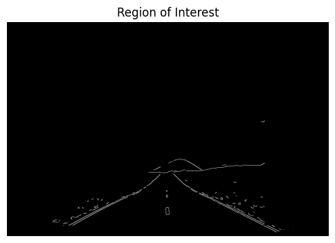
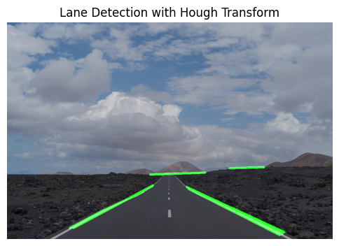

# 🛣️ Road Lane Detection using Hough Transform

This project is part of a computer vision assignment focused on the **detection of road lanes** in an image using the **Hough Transform**. It is implemented from scratch using classical computer vision techniques without deep learning.

---

## 🎯 Objective

The main goal is to detect and highlight **road lane lines** in a given input image. This is achieved using the **Canny Edge Detector**, **Region of Interest (ROI) masking**, and the **Hough Line Transform**.

---

## 📚 Theoretical Background

### 🌀 Hough Transform

The Hough Transform is a feature extraction technique used to identify **lines**, **circles**, or other shapes in an image. For line detection, we use the **normal form** of the line equation:

Where:
- **θ** is the angle of inclination.
- **ρ** is the perpendicular distance from the origin.

An **accumulator array** is used to vote for potential (ρ, θ) values. The values with the highest votes correspond to the most likely lines.

---

## 🛠️ Implementation Pipeline

### 1️⃣ Image Smoothing
- A **2D median filter** is applied to reduce noise in the image while preserving edges.

### 2️⃣ Edge Detection
- **Canny Edge Detection** is used with high thresholding values to detect strong edges.
- This step converts the image into a binary edge map.

### 3️⃣ Region of Interest (ROI) Selection
- Since we are only interested in lane lines, a **polygon mask** is applied to limit processing to the road area only.

### 4️⃣ Hough Accumulation
- A custom **accumulator array** is created to map votes for various (ρ, θ) combinations.
- The resulting accumulator is visualized to show the voting intensity.

### 5️⃣ Post-Processing and Line Drawing
- Peaks in the accumulator are detected.
- **Non-maximum suppression** is applied to refine line selection.
- Lines are drawn over the original image to visualize detected lanes.

---

## 🖼️ Example Output

| Original Image | Edge Detection + ROI | Final Lane Detection |
|----------------|----------------------|-----------------------|
|  |  |

---

## 🧪 Technologies Used

- Python
- OpenCV
- NumPy
- Matplotlib (for visualizing Hough space)

---

## 📁 Project Structure
📁 hough-transform-lane-detection/
┣ 📄 README.md ← This file

┣ 📓 hough_lane_detection.ipynb ← Main notebook with implementation

┣ 📁 inputs/ ← Test images

┣ 📁 outputs/ ← Lane detection results

